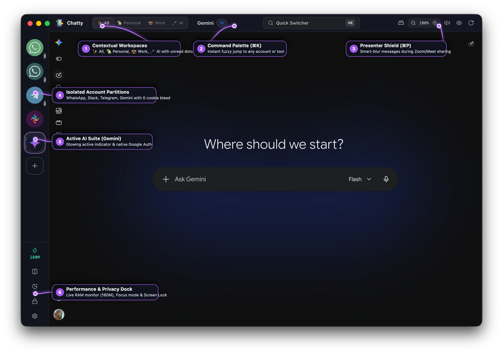
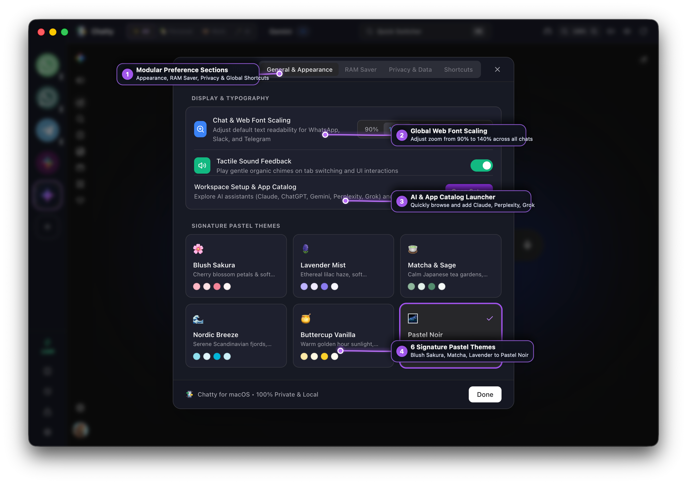
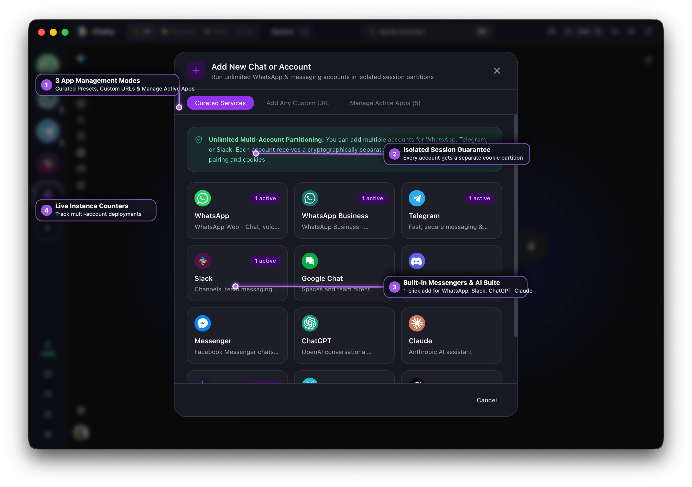

<div align="center">


# Chatty

### The Local-First, Privacy-Centric Multi-Chat & AI Workstation for macOS
**Run WhatsApp, Slack, Telegram, Google Chat, Discord & Modern AI Assistants (Claude, ChatGPT, Gemini, Perplexity, Grok) side-by-side with zero cloud dependencies.**

[](https://apple.com)
[](https://github.com)
[](https://github.com)
[](https://github.com)
[](LICENSE)

</div>

---

## 📑 Table of Contents

- [🌟 Why Chatty?](#-why-chatty)
- [📸 App Tour & Visual Walkthrough](#-app-tour--visual-walkthrough)
  - [1. Main Workspace & AI Integration](#1-main-workspace--ai-integration)
  - [2. System Settings & Customization](#2-system-settings--customization)
  - [3. Add & Manage Apps Modal](#3-add--manage-apps-modal)
- [🔒 Deep Privacy & Security Suite](#-deep-privacy--security-suite)
  - [🛡️ Presenter Mode (Anti-PII Screen-Share Blur)](#️-presenter-mode--anti-pii-screen-share-blur-p)
  - [🔒 Obsidian Privacy Shield](#-obsidian-privacy-shield-l)
  - [☕ Pomodoro Break Companion](#-pomodoro-break-companion)
- [🪄 Built-in AI Workstation](#-built-in-ai-workstation)
- [🪟 Workspaces, Split-Screen & Productivity](#-workspaces-split-screen--productivity)
  - [💼 Smart Workspaces & Personas](#-smart-workspaces--personas)
  - [⚡ 60fps Dual Split-Screen Engine](#-60fps-dual-split-screen-engine-s)
  - [🔔 Smart Background Notifications](#-smart-background-notifications)
  - [🚀 Onboarding & Workspace Setup Wizard](#-onboarding--workspace-setup-wizard)
- [🎨 Signature Pastel Themes](#-signature-pastel-themes)
- [⌨️ Global Keyboard Shortcuts](#️-global-keyboard-shortcuts)
- [📦 Packaging & Distribution](#-packaging--distribution)
- [🛠️ Development & Build Instructions](#️-development--build-instructions)
- [📁 Repository Structure](#-repository-structure)
- [📄 License](#-license)

---

## 🌟 Why Chatty?

Most multi-account messenger wrappers route user traffic through third-party cloud proxy servers, collect product telemetry, or consume gigabytes of system memory with unoptimized background tabs.

**Chatty is engineered with a strict local-first philosophy:**

- 🔒 **100% Local-Only Trust**: Zero cloud middleman servers, zero proxies, zero analytics, and zero tracking. All network traffic routes exclusively and directly between your Mac and the official endpoints of WhatsApp, Slack, Anthropic, OpenAI, or Google.
- 🛡️ **True Cryptographic Session Isolation**: Run unlimited independent accounts (e.g. *Personal WhatsApp*, *Business WhatsApp*, *Client Slack 1*, *Client Slack 2*) with separate persistent cookie partitions (`persist:service_<uuid>`). Sessions never collide or bleed state.
- ⚡ **GPU-Accelerated Compositing**: Promoted to macOS CoreAnimation Metal GPU layers for fluid 60/120fps scrolling and instantaneous split-pane divider resizing on Apple Silicon ProMotion displays.
- 🚀 **Modern Runtime**: Powered by **Electron 44.2.0**, **Chromium 152.0.7977.76**, and **Node.js 24.20.0**, satisfying late-2026 web requirements out-of-the-box.

---

## 📸 App Tour & Visual Walkthrough

### 1. Main Workspace & AI Integration
<div align="center">
  
</div>

| # | Component | Capability & Explanation |
| :---: | :--- | :--- |
| **①** | **Contextual Workspaces** | Organize services into contexts: **`✨ All`**, **`🏡 Personal`**, **`💼 Work`**, and **`🪄 AI`**. Displays real-time unread dots for background workspaces. |
| **②** | **Command Palette (`⌘K`)** | Spotlight-style instant fuzzy switcher. Jump directly to any conversation, toggle Presenter Mode, swap split panes, or sleep background tabs. |
| **③** | **Presenter Shield (`⌘P`) & Utilities** | Instant anti-PII screen-sharing protection (blurs messages & contact phone numbers), font zoom controls, and sound toggles. |
| **④** | **Isolated Account Partitions** | Run multiple accounts for the same service (e.g. 2 WhatsApps, 3 Slacks) with zero cookie collisions. Scaled 46px icons with clean unread badges. |
| **⑤** | **Active AI Assistant** | Seamless on-device access to Google Gemini Web, Anthropic Claude, OpenAI ChatGPT, Perplexity AI, and xAI Grok. |
| **⑥** | **Performance & Privacy Dock** | Live RAM gauge (`180M`), Split View toggle (`⌘S`), Focus Mode (`⌘D`), and the Obsidian Privacy Screen Lock (`⌘L`). |

---

### 2. System Settings & Customization
<div align="center">
  
</div>

| # | Setting | Description & Usage |
| :---: | :--- | :--- |
| **①** | **Modular Preference Sections** | Switch between **General & Appearance**, **RAM Saver** (configurable background notifications & auto-sleep), **Privacy & Data**, and **Keyboard Shortcuts**. |
| **②** | **Global Web Font Scaling** | 1-click text readability presets (**`90%`**, **`100%`**, **`110%`**, **`125%`**, **`140%`**) applied across all webviews. |
| **③** | **AI & App Catalog Launcher** | Re-launch the onboarding catalog to discover and add new AI models and messaging services anytime. |
| **④** | **Signature Pastel Themes** | Six handcrafted palettes: **Blush Sakura**, **Lavender Mist**, **Matcha & Sage**, **Nordic Breeze**, **Buttercup Vanilla**, and **Pastel Noir** (default). |

---

### 3. Add & Manage Apps Modal
<div align="center">
  
</div>

| # | Feature | Description & Usage |
| :---: | :--- | :--- |
| **①** | **3 App Management Modes** | Choose from **Curated Services** (official messengers & AI), **Add Any Custom URL** (Notion, Linear, GitHub), or **Manage Active Apps** (safe 1-click app removal). |
| **②** | **Cryptographic Partitioning** | Guarantees that each added instance receives an isolated Chromium cookie partition (`persist:service_<uuid>`). |
| **③** | **Curated Messengers & AI Suite** | Instant 1-click addition for WhatsApp, WhatsApp Business, Telegram, Slack, Google Chat, Discord, Messenger, ChatGPT, Claude, Gemini, Perplexity, and Grok. |
| **④** | **Live Instance Counters** | Real-time badges (`1 active`) show how many accounts of each service are deployed in your workspace. |

---

## 🔒 Deep Privacy & Security Suite

### 🛡️ Presenter Mode / Anti-PII Screen-Share Blur (`⌘P`)
When presenting your screen on Zoom, Google Meet, Slack Huddles, or Microsoft Teams, confidential messages and sensitive contact numbers can easily leak.
- Pressing **<kbd>⌘</kbd> <kbd>P</kbd>** toggles Chatty's **Presenter Shield**.
- Injects smart CSS blurring rules across WhatsApp, Telegram, Slack, and Discord.
- Chat bubbles, message previews, contact phone numbers, media attachments, and avatars are automatically blurred.
- **Hover to Reveal**: Hovering your cursor over any specific message cleanly unblurs only that item, allowing you to read incoming messages privately without exposing surrounding conversations.

### 🔒 Obsidian Privacy Shield (`⌘L`)
Lock down Chatty with a single keystroke whenever stepping away from your workspace:
- **Dedicated High-Contrast Themes**:
  - *Dark Theme (Noir)*: Deep obsidian dark glass (`bg-[#0B0D14]`) with rich slate cards and glowing typography.
  - *Light Themes (Sakura, Lavender, Matcha, Nordic, Buttercup)*: Clean, opaque off-white backdrop (`bg-[#F4F5F9]`) with pure white Apple-style cards and deep charcoal typography (`text-zinc-900`) that completely eliminates background chat bleed-through.
- **PIN-Protected Lock**: Optional local security PIN to lock access to all open chats and models.
- **Apple-Style Clock & Date**: Clean typography with rapid unlock via <kbd>Enter</kbd> or <kbd>Esc</kbd>.

### ☕ Pomodoro Break Companion
Integrated directly into the Lock Screen, Chatty includes an automatic Pomodoro Break Companion to encourage healthy screen pauses:
- **One-Click Durations**: **`5m`** Quick Recharge, **`15m`** Deep Rest, and **`25m`** Focus Session.
- **Animated Circular Progress Gauge**: Live minute/second countdown with animated progress track.
- **Synthesized Ambient Chime**: When your break completes, Chatty plays a soothing crystalline chime (`Web Audio API`) to let you know you're refreshed and ready to return.

---

## 🪄 Built-in AI Workstation

Chatty treats conversational AI models as first-class citizens alongside team and personal chats. Switch between or split-screen your preferred models with zero session cross-talk:

- 🪄 **Anthropic Claude**: Complex coding, reasoning, system architecture, and long-form analysis.
- 🟢 **OpenAI ChatGPT**: Conversational drafting, brainstorming, editing, and task automation.
- 💎 **Google Gemini Web**: Multimodal intelligence, research, and Google ecosystem integration (with native authentication bypass).
- 🌐 **Perplexity AI**: Grounded web search, real-time citations, and source discovery.
- ⬛ **xAI Grok**: Real-time X/Twitter intelligence and rapid conversational exploration.

---

## 🪟 Workspaces, Split-Screen & Productivity

### 💼 Smart Workspaces & Personas
Organize communication channels by context using the Header Segmented Control:
- **`✨ All`**: Unified view of every connected service and AI assistant.
- **`🏡 Personal`**: Personal WhatsApp, Telegram, Discord, and Messenger.
- **`💼 Work`**: Slack teams, WhatsApp Business, and Google Chat.
- **`🪄 AI`**: Claude, ChatGPT, Gemini, Perplexity, and Grok.
- *Real-time unread dots* notify you of incoming messages in background workspaces.

### ⚡ 60fps Dual Split-Screen Engine (`⌘S`)
Multitask across any two accounts side-by-side:
- **Header Pane Selectors**: Dedicated dropdowns for Left (`L:`) and Right (`R:`) panes to pair any two accounts in seconds.
- **One-Click Swap (`⌘⌥S`)**: Instantly exchange left and right sides.
- **Ratio Presets**: Quick-toggle between **`50:50`**, **`70:30`**, and **`30:70`** splits with a single click.
- **Smooth GPU Divider**: Fullscreen drag shield prevents embedded webviews from capturing mouse events, delivering 60/120fps resizing with double-click reset to 50:50.
- **Targeted Split Placement**: Right-click any app in the sidebar to open it specifically in the Left or Right split pane.

### 🔔 Smart Background Notifications
- Inbound messages from WhatsApp, Slack, Telegram, Discord, and Google Chat are captured via the Web Notification API and routed to native macOS Notification Center banners with sound.
- **Click to Focus**: Clicking any banner brings Chatty to the front and immediately switches to the corresponding account.
- **Configurable Background Connections**: Inactive tabs remain connected in the background DOM by default so you never miss messages, or can be suspended in **Settings > Memory Efficiency** for aggressive RAM saving on battery.
- **Never Sleep Option**: Right-click any critical app in the sidebar to toggle **"Never Sleep (Always On)"**.
- **Focus Mode (`⌘D`)**: Silences all audio chimes and suppresses notification banners during deep work.

### 🚀 Onboarding & Workspace Setup Wizard
- **Fresh Installations**: New users are guided through a setup wizard requiring at least 1 messaging service and 1 AI assistant to configure their personalized starting workspace.
- **Existing Users**: An interactive catalog displays all available services, marks currently active accounts (`✓ Added`), and offers 1-click additions for newly introduced models and platforms. Accessible anytime via **Settings > General > "Workspace Setup & App Catalog"**.

---

## 🎨 Signature Pastel Themes

Chatty features six handcrafted themes built for visual comfort and eye strain reduction:
- 🌸 **Blush Sakura**: Soft cherry blossom pinks, blush rose, and warm cream.
- 🪻 **Lavender Mist**: Lilac, periwinkle, and frosted glass.
- 🍵 **Matcha & Sage**: Japanese tea gardens, eucalyptus, and clean clarity.
- 🌊 **Nordic Breeze**: Scandinavian sky blue and arctic glacier slate.
- 🍯 **Buttercup Vanilla**: Golden hour honey, lemon curd, and whipped vanilla.
- 🌌 **Pastel Noir**: Deep obsidian night with iridescent luminescent accents.

---

## ⌨️ Global Keyboard Shortcuts

| Shortcut | Action |
| :--- | :--- |
| <kbd>⌘</kbd> <kbd>1</kbd> .. <kbd>9</kbd> | Jump directly to chat account by index |
| <kbd>⌘</kbd> <kbd>K</kbd> | Open Command Palette & Universal Switcher |
| <kbd>⌘</kbd> <kbd>P</kbd> | Toggle Presenter Mode (Screen-Share Anti-PII Blur) |
| <kbd>⌘</kbd> <kbd>S</kbd> | Toggle Side-by-Side Split View |
| <kbd>⌘</kbd> <kbd>⌥</kbd> <kbd>S</kbd> | Swap Left & Right Split Panes |
| <kbd>⌘</kbd> <kbd>L</kbd> | Lock Screen with Obsidian Privacy Shield & Pomodoro |
| <kbd>⌘</kbd> <kbd>D</kbd> | Toggle Focus Mode / Do Not Disturb |
| <kbd>⌘</kbd> <kbd>N</kbd> | Open Add / Manage Apps Dialog |
| <kbd>⌘</kbd> <kbd>R</kbd> | Reload Active Chat Session |
| <kbd>⌘</kbd> <kbd>,</kbd> | Open Preferences & Theme Settings |

---

## 📦 Installation & GitHub Releases

### Downloading Pre-built Binaries
Download the latest signed/packaged DMG directly from the [GitHub Releases](../../releases) tab:
1. Download `Chatty-<version>-arm64.dmg` (Apple Silicon M1/M2/M3/M4) or Intel build.
2. Open the DMG and drag **Chatty.app** into your `/Applications` folder.

> **Zero Data Loss on Updates**: When upgrading via a new DMG, macOS replaces only the application bundle in `/Applications`. All login cookies, persistent partitions, themes, and settings are stored safely in `~/Library/Application Support/Chatty/` and remain permanently preserved.

#### macOS Gatekeeper for Community Builds
If macOS displays an unverified developer warning upon initial launch:
- **Right-click (or Control-click)** `Chatty.app` in `/Applications` and select **Open** > **Open**.
- Or run this one-time command in Terminal:
  ```bash
  xattr -cr /Applications/Chatty.app
  ```

---

## 🛠️ Development & Build Instructions

### Prerequisites
- macOS (Apple Silicon or Intel)
- Node.js 20+ (tested on Node v20/v22/v24)
- npm 9+

### Quick Start
```bash
# Clone the repository
git clone https://github.com/your-username/chatty.git
cd chatty

# Install dependencies
npm install

# Start in Development Mode (Vite Hot-Reload + Electron)
npm run app:dev
```

### Packaging Release DMGs
Chatty includes an automated release script that bumps the version, archives existing builds, and packages fresh installers:

```bash
# Compile and package a patch release (e.g. v1.0.8 -> v1.0.9)
npm run release

# Compile and package a minor release (e.g. v1.0.8 -> v1.1.0)
npm run release:minor

# Standalone build of the current version without bumping
npm run dist
```

All compiled DMGs are output to `release/` (which is excluded from git tracking to keep repository clones fast and lightweight). Upload compiled `.dmg` files directly to your GitHub Release tags.

---

## 📁 Repository Structure

```
chatty/
├── electron/                  # Electron Main Process & Preload Scripts
│   ├── main.ts                # Window lifecycle, session partitions, native headers
│   ├── preload.ts             # ContextBridge IPC bridge
│   └── webview-preload.ts     # In-guest notification routing & CSS shield injection
├── src/                       # React 18 Renderer Process
│   ├── components/            # Header, Sidebar, SplitView, Modals, PrivacyShield
│   ├── context/               # Global state (AppContext, partitions, settings)
│   ├── constants/             # Service presets, theme definitions, workspaces
│   ├── services/              # Platform bridge & memory monitor
│   └── styles/                # Tailwind CSS & CoreAnimation hardware styles
├── public/                    # Scalable vector assets & app icons
├── scripts/                   # Automated packaging & build scripts
├── package.json               # Dependencies & Electron 44 configuration
└── README.md
```

---

## 📄 License

MIT License. Built with care for privacy and craft.
